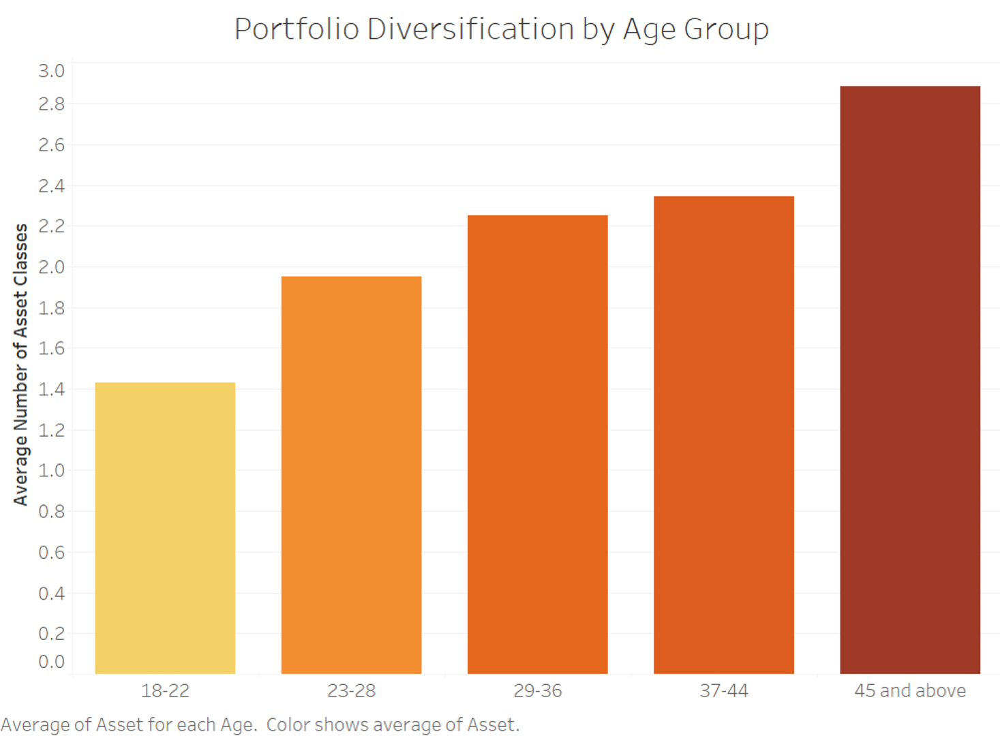
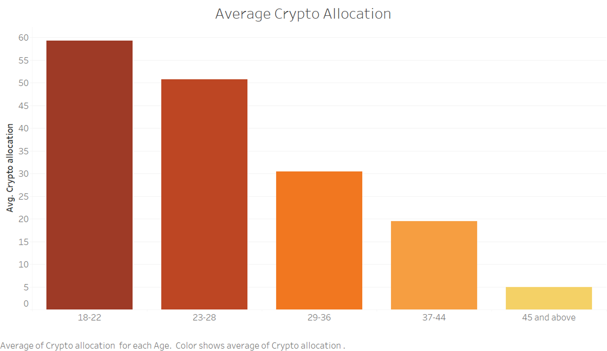

# Group Research Project Report

## Team Members:
1. Khilji Syed Izhan
2. Kaszas Tunde Lilla
3. Nguyen Quang Anh
4. Malchiodi Marco

## Declaration
...

## Introduction
...

## Methodology
... 

## Results

Our findings strongly support the hypothesis that as investors age, they diversify their portfolios across a broader range of asset classes. 

Figure 1 (Portfolio Diversification by Age Group) highlights a clear trend: younger investors average only 1.2 asset classes in their portfolios, emphasizing concentrated investments, often in high-risk, high-reward assets. In contrast, older investors, particularly those aged 45 and above, average 2.8 asset classes, showcasing a deliberate approach to risk mitigation and stability through diversification.

For younger age groups, limited diversification appears influenced by two key factors:

- **Constrained Disposable Income:** Drives them toward investments promising higher returns, despite the inherent risks.
- **Internet and Social Media Influence:** Encourages preference for speculative assets like cryptocurrencies frequently marketed as lucrative opportunities.

In contrast, older investors prioritize reducing exposure to risk. 

As depicted in Figure 2 (Average Crypto Allocation), the allocation to high-risk assets like cryptocurrencies declines sharply with age. The youngest group allocates over 50% of their portfolios to these assets, whereas this drops to under 5% for the 45+ age group. This shift underscores a transition from speculative strategies to diversified portfolios aligned with long-term financial stability, demonstrating distinct generational approaches to investment.

 

## Discussion
... 

## Conclusion

This study showcased key insights into age-based investment behaviors, providing actionable opportunities for financial service providers to refine their offerings. Younger investors, characterized by a high tolerance for risk and a strong preference for speculative assets like cryptocurrencies, represent a growing but underserved segment. Conversely, older investors, who prioritize diversification and risk mitigation, align more closely with traditional financial products.

To capture the younger market, financial service providers should develop targeted products that balance high-growth opportunities with stability. This could include hybrid portfolios combining speculative and conventional assets, supported by interactive platforms that resonate with their digital fluency. Additionally, financial literacy tools embedded within these platforms can help younger investors better understand risk management and portfolio diversification.

For older clients, providers should focus on personalized advisory services that emphasize stability and risk management. Automated portfolio diversification tools, income-focused investment strategies, and conservative high-yield options can address their long-term financial goals while maintaining engagement.

Aligning financial services with the distinct needs of these generational segments not only improves customer satisfaction but also drives retention and profitability. By integrating these strategies, financial service providers can position themselves as leaders in delivering tailored, effective solutions that adapt to evolving market demands. 

## Reflection

Our team effectively implemented Agile principles through structured weekly Sunday meetings and ongoing communication in a dedicated group chat. The meetings provided a platform to review progress, discuss challenges, and plan next steps, ensuring that everyone remained aligned and engaged. The group chat served as a space for quick clarifications, sharing insights, and resolving questions, which kept the workflow efficient.

Workload distribution was equitable, with all members contributing equally to the project. This balance ensured accountability and made sure that everyone was actively involved in the process. Open discussions during meetings encouraged critical thinking and allowed different perspectives to shape our decisions, ultimately improving the quality of our work.

Despite these strengths, we encountered challenges such as occasional scheduling conflicts and the difficulty of balancing project tasks with other commitments. However, the team’s adaptability and proactive communication helped us navigate these obstacles effectively. For example, when a team member faced time constraints, others stepped in to provide support, ensuring that deadlines we set were met without compromising quality.

By embracing Agile principles, we created a collaborative, flexible environment that not only overcame challenges but also enhanced the overall quality and efficiency of our work.

## References
... 
